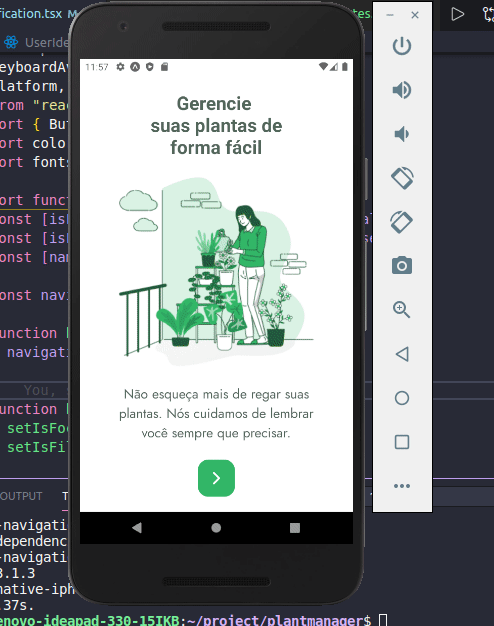

<h3 align="center">
 Plantmanager - React-Native, typescript.
</h3>

<p align="center">
   
</p>

### :computer: How To Run

- Primeiro instale as dependencias:

```bash
yarn
```

### :computer: Scripts de inicialização:

- Inicie a aplicação em modo desenvolvimento!

```bash
expo start
```

## 🤔 Tem alguma feature e quer contribuir?

- Faça um fork desse repositório;
- Cria uma branch com a sua feature: `git checkout -b minha-feature`;
- Faça commit das suas alterações: `git commit -m 'feat: Minha nova feature'`;
- Faça push para a sua branch: `git push origin minha-feature`.

Depois que o merge da sua pull request for feito, você pode deletar a sua branch.

---

Make with ♥ by Wesley Guerra :wave:
